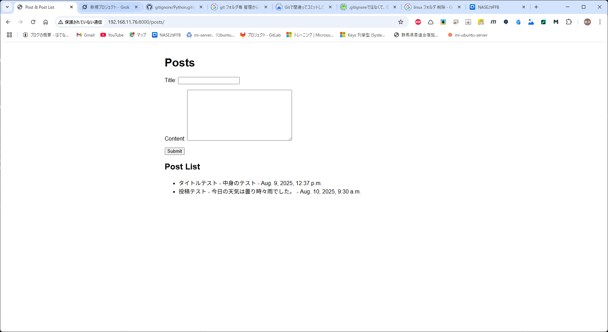

# Django
## 機能追加
環境構築で作成した myproject に機能を追加していく。

### 投稿ページを追加する。

list の上部に投稿用のフォームを追加する。

#### 1. myapp　に、 forms.py を追加する。
```
from django import forms
from .models import Post

class PostForm(forms.ModelForm):
    class Meta:
        model = Post
        fields = ['title', 'content']
```

#### 2. myapp/Views.py を修正する。 
```
from django.shortcuts import render, redirect  # redirect 追加
from .models import Post
from .forms import PostForm                 # 追加行

def post_list(request):
    posts = Post.objects.all()
    form = PostForm()                       # 追加行

    # if文まるっと追加
    if request.method == 'POST':
        form = PostForm(request.POST)
        if form.is_valid():
            form.save()
            return redirect('post_list')    # redirect

    return render(request, 'myapp/post_list.html', {'posts': posts, 'form': form})      # 'form': form を追加
```

#### 3. myapp/templates/myapp/post_list.html を修正する。

```
<!DOCTYPE html>
<html>
    <head>
        <meta charset="UTF-8">
        <title>Post & Post List</title>
        <style>
            body {
                font-family: Arial, sans-serif;
                max-width: 800px;
                margin: 0 auto;
                padding: 20px;
            }
        </style>
    </head>
    <body>
        <h1>Posts</h1>
        <!-- フォーム作成処理 -->
        <form method="post">
            
            {{ form.as_p }}
            <button type="submit">Submit</button>
        </form>
        <h2>Post List </h2>
        <!-- 前回はこのあたりだけ。といいつつ、content 追加 -->
        <ul>
            
                <li>{{ post.title }} - {{ post.content }} - {{ post.created_at }}</li>
            
        </ul>
    </body>
</html>
```

### 4. 完成


