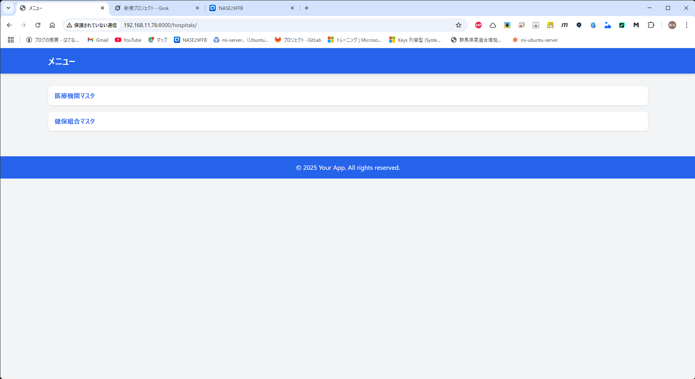
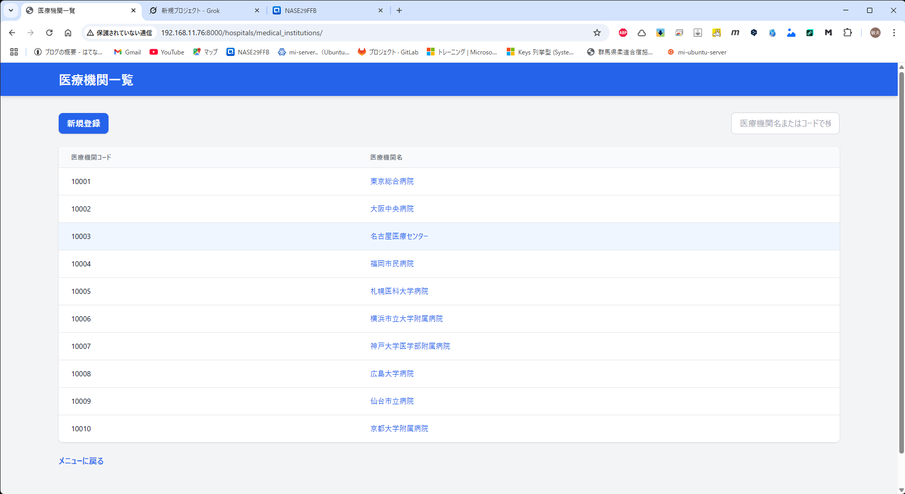
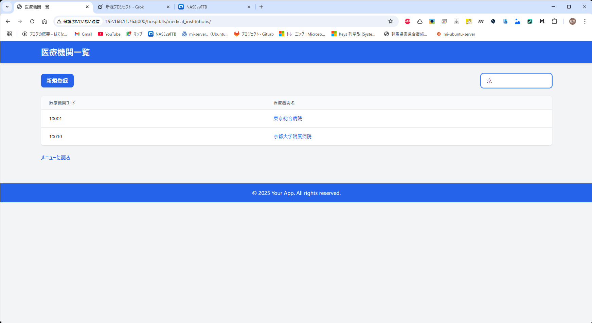

# Django, qwen code

# 1. qwen code で、機能追加を行う。  

[詳細](../Genarative%20AI/qwen_code.md)

# 2. Grok でデザイン修正

```
Django 内の templates 内に作成した html ファイルです。
デザインが今一つなので、Grok のセンスでかっこよくして！！
<!DOCTYPE html>
<html>
　　～中略～
</body>
</html>
```



調子に乗る。
```
すばらしい！
次の一覧画面もかっこよくしてほしいです。

・必須項目を表示する。
・絞り込み機能を付けてください。

# models
class MedicalInstitution(models.Model):
    code = models.CharField(max_length=5, unique=True, verbose_name='医療機関コード')
    name = models.CharField(max_length=255, verbose_name='医療機関名')
    postal_code = models.CharField(max_length=10, blank=True, verbose_name='郵便番号')
    address = models.TextField(blank=True, verbose_name='住所')
    insurance_code = models.CharField(max_length=10, blank=True, verbose_name='保険機関コード')

    def __str__(self):
        return self.name

    class Meta:
        verbose_name = '医療機関'
        verbose_name_plural = '医療機関'

# ソース
<!DOCTYPE html>
<html>
<head>
    <title>医療機関一覧</title>
</head>
<body>
    <h1>医療機関一覧</h1>
    <a href="">新規登録</a>
    <ul>
        
            <li><a href="">{{ mi.name }}</a></li>
        
    </ul>
    <a href="">メニューに戻る</a>
</body>
</html>
```

  

絞込み機能もちゃんと動いた。  
