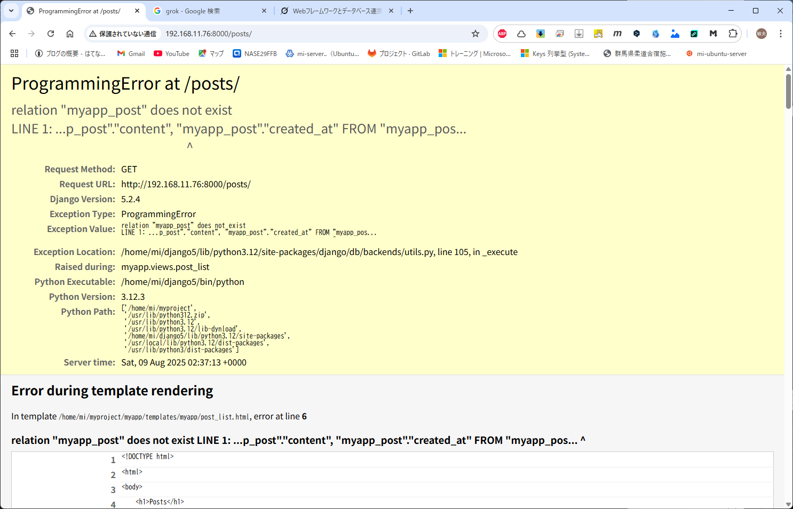
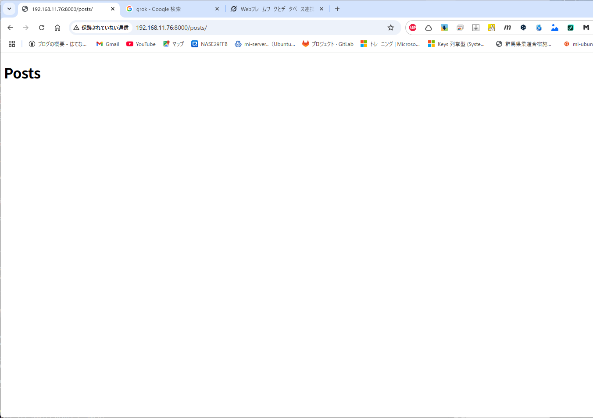

2025/08/03

# Django

## 環境構築

Django＋Postgresql という構成で環境構築を行う。

設定先OS：Ubuntu 24.04

### 準備

1. Python インストール  
```
// Python 3.8 以上をインストールする。  
$ python3 --version
Python 3.12.3

// 仮想環境を作成する。
$ python3 -m venv --system-site-packages ~/django5
The virtual environment was not created successfully because ensurepip is not
available.  On Debian/Ubuntu systems, you need to install the python3-venv
package using the following command.

    apt install python3.12-venv

You may need to use sudo with that command.  After installing the python3-venv
package, recreate your virtual environment.

Failing command: /home/mi/django5/bin/python3

// 仮想環境のパッケージがインストールされていなかった。
$ sudo apt install -y python3.12-venv

// 再チャレンジ
$ python3 -m venv --system-site-packages ~/django5

// 仮想環境に入る
$ source ~/django5/bin/activate

// Django と、PostgreSQL ドライバのインストール
$ pip install django psycopg2-binary

// 仮想環境から出る
$ deactivate
```

Pythonで、仮想環境ってどういうことかなと思ったが、Pythonのバージョンも含めて、独立した環境を作るということのようで。  
venv って、Virtual Enviroment かな。  

参考：https://python-engineer.co.jp/what-venv/

2. PostgreSQL のセットアップ。

```
// PostgreSQL をインストールする。
$ sudo apt-get install postgresql

// データベースに接続
$ sudo -u postgres psql
// データベース作成
# CREATE DATABASE myapp_django_1st;
// PostgreSQL より離脱
# exit;
```

### Django プロジェクトの作成

1. プロジェクト初期化
```
// 仮想環境に入る
$ source ~/django5/bin/activate
// プロジェクト初期化
$ django-admin startproject myproject
$ cd myproject
```

2. データベース設定
```
$ nano ./myproject/settings.py
```

```
# Database
# https://docs.djangoproject.com/en/5.2/ref/settings/#databases

DATABASES = {
    'default': {
        'ENGINE': 'django.db.backends.sqlite3',
        'NAME': BASE_DIR / 'db.sqlite3',
    }
}
```
  ↓↓↓↓
```
# Database
# https://docs.djangoproject.com/en/5.2/ref/settings/#databases

DATABASES = {
    'default': {
        'ENGINE': 'django.db.backends.postgresql',
        'NAME': 'myapp_django_1st',
        'USER': 'postgres',
        'PASSWORD': 'yourpassword',
        'HOST': 'localhost',
        'PORT': '5432',
    }
}
```

3. アプリ作成とモデル定義

新しいアプリを作成
```
$ python manage.py startapp myapp_django_1st
```

myapp/models.pyにモデルを定義（例: シンプルなブログ投稿モデル）
```
$ nano ./myapp/models.py
```

```
from django.db import models

class Post(models.Model):
    title = models.CharField(max_length=100)
    content = models.TextField()
    created_at = models.DateTimeField(auto_now_add=True)

    def __str__(self):
        return self.title
```

4. マイグレーション（失敗）

モデルをデータベースに反映
```
$ python manage.py makemigrations
(home)/django5/lib/python3.12/site-packages/django/core/management/commands/makemigrations.py:161: RuntimeWarning: Got an error checking a consistent migration history performed for database connection 'default': connection to server at "localhost" (127.0.0.1), port 5432 failed: FATAL:  password authentication failed for user "postgres"
connection to server at "localhost" (127.0.0.1), port 5432 failed: FATAL:  password authentication failed for user "postgres"

  warnings.warn(
No changes detected
// PostgreSQLへの接続エラー
```

PostgreSQLに、パスワードを設定する。  
ついでに、DBへの接続設定は .env 経由にする。

5. データベース設定（再）

データベースのユーザーにパスワード設定
```
// データベースに接続
$ sudo -u postgres psql
// パスワード設定
\password postgres
```

PostgreSQL の認証設定変更
```
$ sudo nano /etc/postgresql/16/main/pg_hba.conf
```

```
# Database administrative login by Unix domain socket
local   all             postgres                                peer
```
  ↓↓↓↓
```
# Database administrative login by Unix domain socket
local   all             postgres                                scram-sha-256
```

```
// データベース再起動
$ sudo systemctl restart postgresql
// パスワードが有効になったか接続試験
$ psql -U postgres -h localhost -d myapp_django_1st
Password for user postgres:
// OK!
```

データベース設定変更
```
$ nano ./myproject/settings.py
```

```
// 先頭
from pathlib import Path
from decouple import config

// Database設定
# Database
# https://docs.djangoproject.com/en/5.2/ref/settings/#databases

DATABASES = {
    'default': {
        'ENGINE': 'django.db.backends.postgresql',
        'NAME': config('DB_NAME'),
        'USER': config('DB_USER'),
        'PASSWORD': config('DB_PASSWORD'),
        'HOST': config('DB_HOST'),
        'PORT': config('DB_PORT'),
    }
}
```

.env ファイルをプロジェクトルード上に作成
```
$ nano ~/myproject/.env
```

```
DB_NAME=myapp_django_1st
DB_USER=postgres
DB_PASSWORD=(password)
DB_HOST=localhost
DB_PORT=5432
```

python-decouple をインストール  

Djangoで、.env を簡単に読み込むためのライブラリとのこと
```
$ pip install python-decouple
```

依存関係を保存
```
$ pip freeze > requirements.txt
```

6. マイグレーション
モデルをデータベースに反映
```
$ python manage.py makemigrations
$ python manage.py migrate
Operations to perform:
  Apply all migrations: admin, auth, contenttypes, sessions
Running migrations:
  Applying contenttypes.0001_initial... OK
  Applying auth.0001_initial... OK
  Applying admin.0001_initial... OK
  Applying admin.0002_logentry_remove_auto_add... OK
  Applying admin.0003_logentry_add_action_flag_choices... OK
  Applying contenttypes.0002_remove_content_type_name... OK
  Applying auth.0002_alter_permission_name_max_length... OK
  Applying auth.0003_alter_user_email_max_length... OK
  Applying auth.0004_alter_user_username_opts... OK
  Applying auth.0005_alter_user_last_login_null... OK
  Applying auth.0006_require_contenttypes_0002... OK
  Applying auth.0007_alter_validators_add_error_messages... OK
  Applying auth.0008_alter_user_username_max_length... OK
  Applying auth.0009_alter_user_last_name_max_length... OK
  Applying auth.0010_alter_group_name_max_length... OK
  Applying auth.0011_update_proxy_permissions... OK
  Applying auth.0012_alter_user_first_name_max_length... OK
  Applying sessions.0001_initial... OK
// OK!
```

Django上からデータベースへの接続確認
```
$ python manage.py dbshell
psql (16.9 (Ubuntu 16.9-0ubuntu0.24.04.1))
SSL connection (protocol: TLSv1.3, cipher: TLS_AES_256_GCM_SHA384, compression: off)
Type "help" for help.

// OK!
```

## ビューとテンプレート

myapp/views.py にビューを追加する。
```
from django.shortcuts import render
from .models import Post

def post_list(request):
    posts = Post.objects.all()
    return render(request, 'myapp/post_list.html', {'posts': posts})
```

myapp/templates/myapp/post_list.html を作成する。
```
$ mkdir myapp/templates
$ mkdir myapp/templates/myapp
$ nano ./myapp/templates/myapp/post_list.html
```

```
<!DOCTYPE html>
<html>
<body>
    <h1>Posts</h1>
    <ul>
        
            <li>{{ post.title }} - {{ post.created_at }}</li>
        
    </ul>
</body>
</html>
```

## URL設定

myproject/urls.py にルーティングを追加する。
```
$ nano ./urls.py 
```
```
from django.urls import path
from myapp.views import post_list

urlpatterns = [
    path('posts/', post_list, name='post_list'),
]
```

## サーバー起動

```
$ python manage.py runserver
```

サーバーは別PCなので、IP指定で・・・、って、エラーになるのね。

https://qiita.com/HyunwookPark/items/3cdecc83328b1b176bfb

```
$ python manage.py runserver 192.168.xxx.xxx:8000
```

で、どうだろうか。


エラー内容は変わったが、やっぱりエラー？

原因は、settings.py のALLOWED_HOSTSが設定されていないからとのこと。

```
$ nano ~/myproject/myproject/settings.py
```
変更
```
ALLOWED_HOSTS = ['localhost',
                 '127.0.0.1',
                 '192.168.xxx.xxx',
                ]
```
再起動は、Ctrl+C でサーバー止めて、再度コマンド
```
$ python manage.py runserver 192.168.xxx.xxx:8000
```

ようやく・・・。


### Postページ

トップ画面はわかったが、たしかPostページを作っていたはず、その起動は？ということで、参照先を戻って見てみると、下記とのこと。

```
http://192.168.xxx.xxx:8000/posts
```

さて、


### エラー修正

エラー内容より、どうやら、以下のどれからしい。

「Page not found (404)」は、Djangoが指定されたURL（/posts/）に対応するビューを見つけられなかったことを意味します。主な原因は以下のいずれかです：

1. URL設定の問題:

    urls.pyに/posts/のルーティングが正しく定義されていない。
プロジェクト全体のurls.py（myproject/urls.py）やアプリのurls.py（myapp/urls.py）の設定ミス。


2. アプリのURL設定がプロジェクトにインクルードされていない:

    アプリ（例: myapp）のurls.pyがプロジェクトのurls.pyにinclude()されていない。


3. ビュー関数の問題:

    myapp/views.pyのpost_listビューが正しく定義されていない、またはインポートミス。

4. テンプレートの問題:

    post_list.htmlが見つからない、またはパスが誤っている。

5. アプリの登録漏れ:

    myappがsettings.pyのINSTALLED_APPSに登録されていない。

6. サーバーの実行状態:

    python manage.py runserverが正しく動作していない、または間違ったポートやURLにアクセスしている。

1.から確認する。

1. 問題なし。  
2. myapp 以下に、urls.py がない。元のサンプルにもなかったので、これが原因かと。  
    対応する。

myapps に、urls.py を追加
```
$ cd ~/myproject/myapp
$ ls
// 無いので作成
$ touch urls.py
$ nano urls.py
```
```
from django.urls import path
from .views import post_list

urlpatterns = [
    path('', post_list, name='post_list'),  # /posts/でアクセス
]
```
まだダメなので、先に進む。

3. 問題なし
4. 問題なし
5. アプリの登録・・・されていない。
```
$ nano settings.py
```
```
INSTALLED_APPS = [
    'django.contrib.admin',
    'django.contrib.auth',
    'django.contrib.contenttypes',
    'django.contrib.sessions',
    'django.contrib.messages',
    'django.contrib.staticfiles',
    'myapp',    // 追加
]
```

エラーメッセージを見る限り、myproject/urls.py に対しての
ルーティングがうまく行われていない。
そんなはずはないのだが、と思っていたが、
 myproject/myproject という階層構造を思い出す。

 ```
 $ nano ~/myproject/myproject/urls.py
 ```

 admin しか設定されていないため、更新

 ```
from django.contrib import admin
from django.urls import path, include

urlpatterns = [
    path('admin/', admin.site.urls),  # 既存の管理画面パス
    path('posts/', include('myapp.urls')),  # myappのURLをインクルード
]
 ```

どうやら、myproject/urls.py の方は誤りらしい。  
間違えて打ち込んじゃったかな？  

とは言え、実はまだうまくいっていない…。  



### エラー修正（再マイグレーション）

メッセージから対象となるテーブルが無いとのこと。  
そのため、再度マイグレーションを実行する。
```
$ cd ~/myproject
// myapp　とアプリケーション名を付けることで、特定のアプリケーションディレクトリに対してマイグレーションを行う。
$ python manage.py makemigrations myapp
// myapp_djago_1st とデータベース名を付けることで、特定のデータベースに対して、テーブルを作成する。
$ python manage.py migrate myapp_django_1st
Operations to perform:
  Apply all migrations: myapp
Running migrations:
  Applying myapp.0001_initial... OK
```

成功かな？  
サービスリロードしたところ、エラーは消えた。



### Django の階層構造について

```
myproject/                  # プロジェクトルートディレクトリ
├── manage.py              # Djangoの管理コマンド用スクリプト
├── .env                   # 環境変数ファイル（前述の設定）
├── myproject/             # 設定用ディレクトリ（プロジェクト設定）
│   ├── __init__.py
│   ├── settings.py       # プロジェクト全体の設定（DB接続等）
│   ├── urls.py           # プロジェクト全体のURL設定
│   ├── asgi.py
│   └── wsgi.py
├── myapp/                 # アプリケーションディレクトリ
│   ├── __init__.py
│   ├── admin.py
│   ├── apps.py
│   ├── migrations/
│   ├── templates/        # view から参照
│   ├── models.py         # モデル定義
│   ├── tests.py
│   ├── views.py          $ ビュー定義
│   └── urls.py           # アプリ専用のURL設定（自分で作成）
└── requirements.txt      # 依存関係ファイル
```

#### myproject の urls.py

- 役割:
    - プロジェクト全体のURLルーティングを管理。
    - すべてのリクエストのエントリーポイントとして機能し、URLを適切なアプリやビューに振り分ける。
    - 通常、アプリごとのurls.pyをinclude()で参照し、モジュラー化を図る。
    - 管理画面（admin/）やプロジェクト全体で共有するURL（例: ルートURL /）を定義。
- 特徴:
    - プロジェクト全体の「入り口」として、アプリ間のURLを統括。
    - アプリが増えても、個々のアプリのurls.pyをインクルードすることで管理が容易。
- 使用場面:
    - プロジェクト全体のURL構造を設計。
    - 複数のアプリ（例: myapp, anotherapp）のURLを統合。
    - 管理画面や静的ファイル、トップページなど、アプリに依存しないURLを定義。
- 例
    ```
    urlpatterns = [
        path('admin/', admin.site.urls),
        path('posts/', include('myapp.urls')),  # ブログアプリ
        path('users/', include('userapp.urls')),  # ユーザー管理アプリ
        path('', include('homeapp.urls')),  # トップページ
    ]
    ```
#### myapp の urls.py

- 役割:
    - 特定のアプリ（例: myapp）専用のURLルーティングを管理。
    - アプリ固有の機能（例: 投稿一覧、投稿詳細など）のURLを定義。
    - プロジェクトのurls.pyからinclude()で参照され、アプリ内のビューにマッピング。
- 特徴:
    - アプリごとの独立したURL管理が可能。
    - アプリを他のプロジェクトに再利用する際に、URL設定を持ち運べる。
- 使用場面:
    - アプリ固有の機能（例: 投稿一覧、投稿作成、投稿編集）のURLを定義。
    - アプリをモジュラー化し、他のプロジェクトで再利用可能にする。
- 例
    ```
    from django.urls import path
    from .views import post_list, post_detail, post_create

    urlpatterns = [
        path('', post_list, name='post_list'),  # /posts/
        path('<int:pk>/', post_detail, name='post_detail'),  # /posts/1/
        path('create/', post_create, name='post_create'),  # /posts/create/
    ]
    ```

