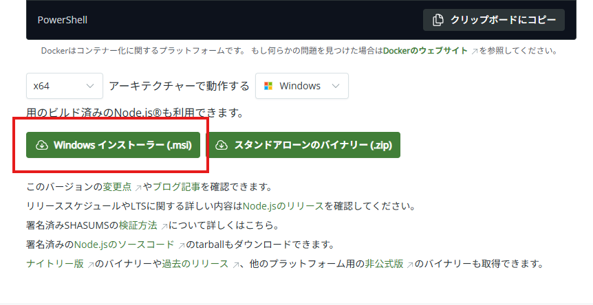

# Gemini CLI を インストールする。

2025/08/25

## 目的

Windows 環境に、Gemini CLI をインストールする。

## 手順

### 1. Nodejs をインストールする。

https://nodejs.org/ja/download

今回は素直にMSIからとする。



同意を求められる箇所以外は、「次へ」のみで進める。

インストール完了後

```
> node -v
v22.18.0
```

### 2. Gemini CLI をインストールする。

https://github.com/google-gemini/gemini-cli

```
> npm install -g @google/gemini-cli

added 436 packages in 27s

128 packages are looking for funding
  run `npm fund` for details
npm notice
npm notice New major version of npm available! 10.9.3 -> 11.5.2
npm notice Changelog: https://github.com/npm/cli/releases/tag/v11.5.2
npm notice To update run: npm install -g npm@11.5.2
npm notice
```

npm をアップデートしろと怒られた。

```
> npm install -g npm@latest
> npm -v
11.5.2
```

リベンジ

```
> npm install -g @google/gemini-cli
```

## Gemini CLI の使用

1. 任意のフォルダに移動する。
2. 下記コマンド実施
    ```
    > gemini
    ```
3. 1.Login with Google を選択
4. デスクトップ側でNode.jsのアクセスについて、ブラウザ側で認証について確認を求められるので、それぞれ承認する。

利用可能になる。
