# qwen code

公式の Github を参照する。　[qwen code](https://github.com/QwenLM/qwen-code)

## 1. node.js のインストール

node.js のインストール要件が、v20以上なのでバージョンを確認

```
$ nodejs -v
v18.19.1
```

```
$ n --version
10.2.0
$ sudo n latest
  installing : node-v24.5.0
       mkdir : /usr/local/n/versions/node/24.5.0
       fetch : https://nodejs.org/dist/v24.5.0/node-v24.5.0-linux-x64.tar.xz
     copying : node/24.5.0
   installed : v24.5.0 (with npm 11.5.1)
   :
```

上の nodejs -v は、変わらない。  
とりあえず進める。  

## 2. qwen code のインストール

```
$ sudo npm install -g @qwen-code/qwen-code@latest
$ qwen --version
0.0.5
```

## 3. OpenRouter のアカウント取得

https://openrouter.ai/

ついでに、アカウント情報（画面右上）から、APIキーも作っておこう。
APIキーは要メモ。

## 4. qwen 起動

```
$ cd ~/myproject
$ qwen
```

- 認証方法： 2. OpenAI を選択
- APIキー : (OpenRouter で取得したAPIキー)
- Base URL: https://openrouter.ai/api/v1
- Model: qwen/qwen3-coder:free

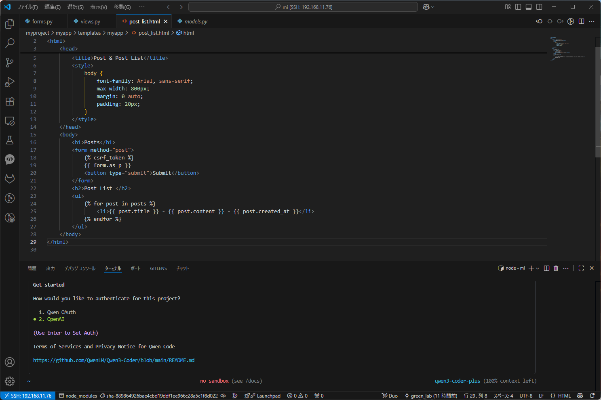


## 5. qwen code の環境変数(.env)設定

```
OPENAI_API_KEY="(your openrouter api key)"
OPENAI_BASE_URL="https://openrouter.ai/api/v1"
OPENAI_MODEL="qwen/qwen3-coder:free"
```

## 6. いろいろ試してみる

```
> 今いるdjangoプロジェクトを解析して、仕様を示すmdファイルを作って 
```

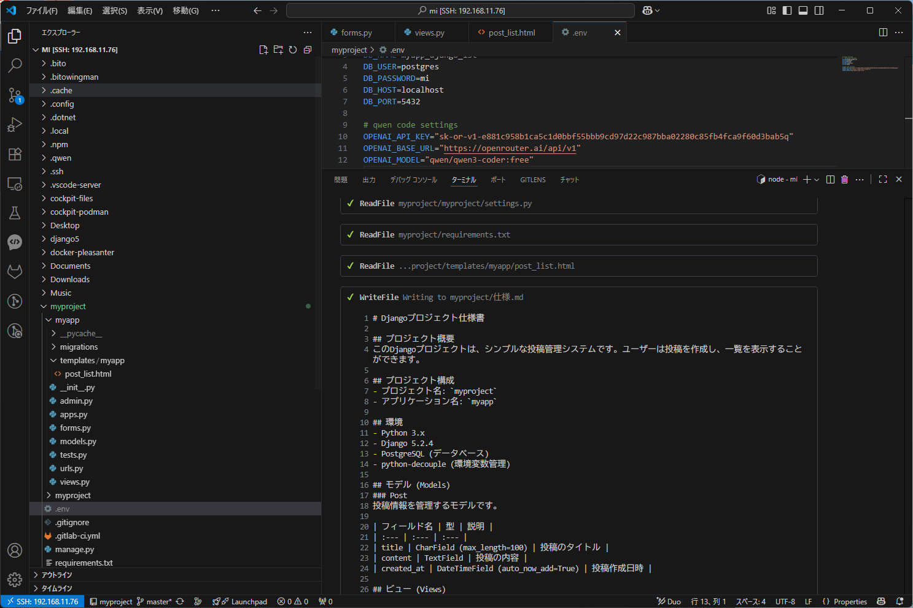

```
> Post_List の見栄えをよくして
```

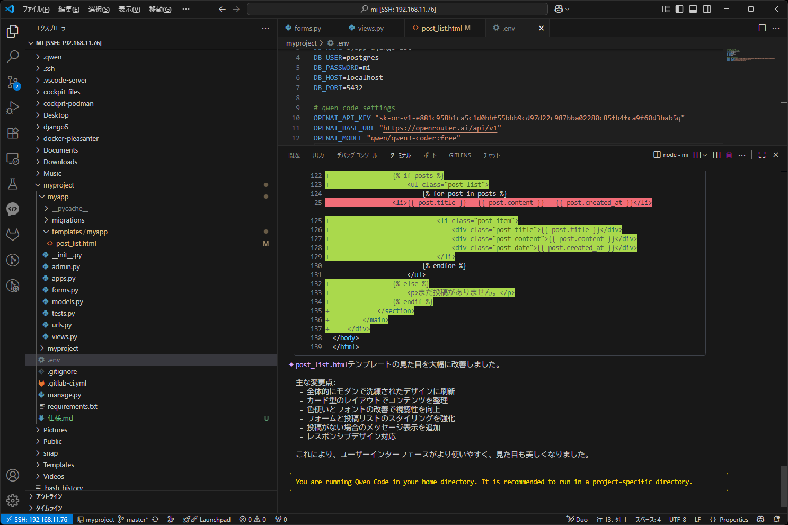

変更前
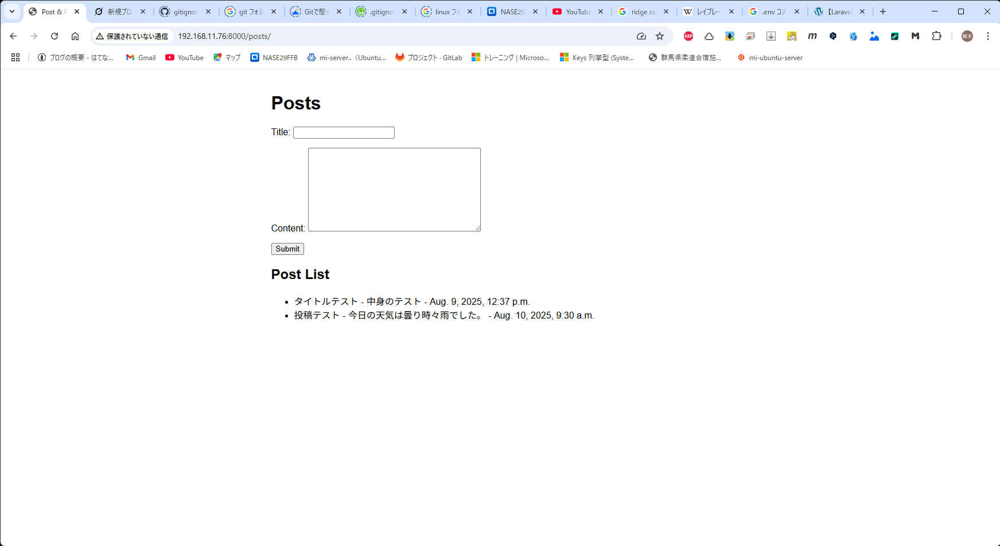

変更後
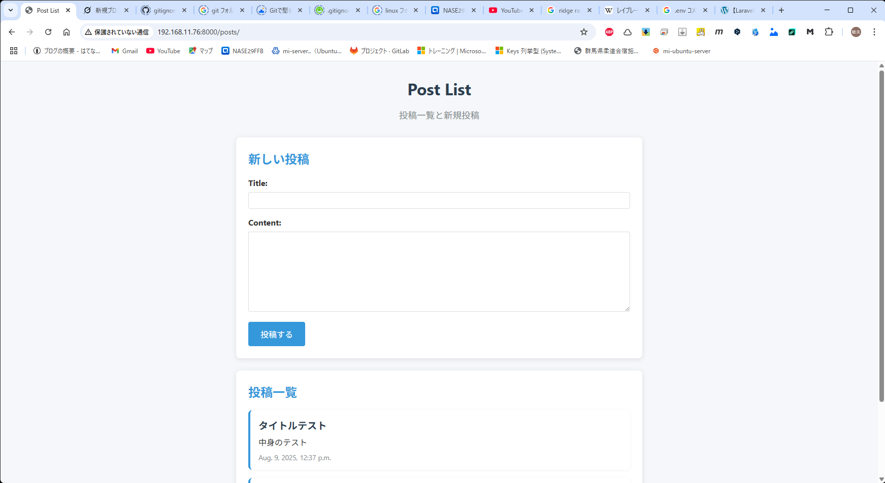

ちょっとした仕様を提示。
```
> # 概要
医療機関マスタと健保組合マスタを作成したい。

# 医療機関マスタ管理項目
・医療機関コード（5桁の数値、必須）
・医療機関名（必須）
・郵便番号
・住所
・保険機関コード（10桁の数値）
・電話番号（1～複数）
	- 担当者名
	- 電話番号
・連絡用メールアドレス（1～複数）
	- 担当者名
	- メールアドレス

# 健保組合マスタ管理項目
・健保コード（5桁の数値、必須）
・健保組合名（必須）
・郵便番号
・住所
・保険者番号（8桁の数値）
・電話番号（1～複数）
	- 担当者名
	- 電話番号
・連絡用メールアドレス（1～複数）
	- 担当者名
	- メールアドレス

# 医療機関マスタと健保組合マスタの関連について
健保組合は契約により、複数の医療機関と契約します。
そのため、この契約を示す関連マスタも作成してください。
なお、契約は基本は単年度で行い、途中開始、途中解除を許すものとします。
ただし、契約期間の重複はNGです。
・健保コード
・医療機関コード
・契約開始日
・契約終了日

# UIについて
・医療機関マスタ
	- 一覧検索
	- 詳細確認
	- 健保組合との関連確認
・健保組合マスタ
	- 一覧検索
	- 詳細確認
	- 医療機関との関連確認

# ダミーデータ
作成するアプリケーションの動作確認を行うため、それぞれ10件ほど
ダミーデータを作成してください。
```

想定とは違う部分も多々あるが、書いた内容で作ってくれた。  
コードの自動修正は指定内容が悪かったためか行ってくれず…。  
※上記のプロンプトを投げる前に、「説明して」というプロンプトを投げたためかと。  

できたもの

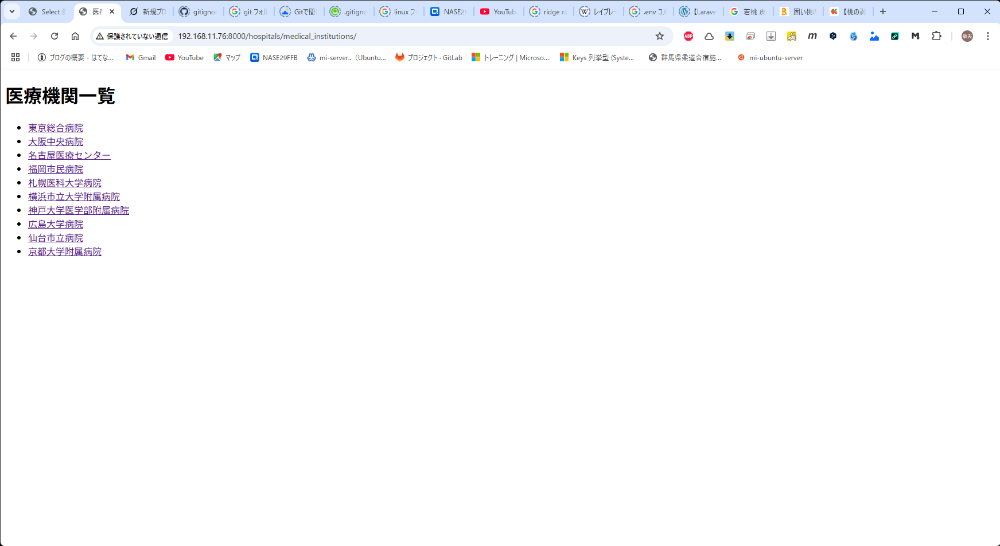

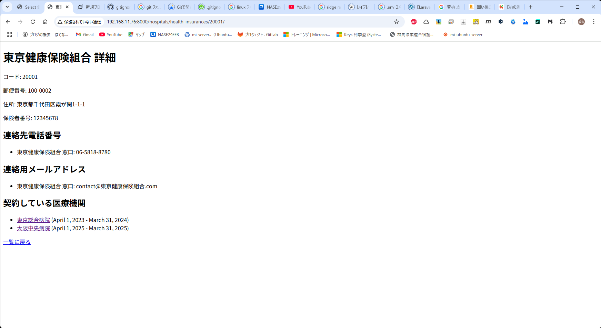

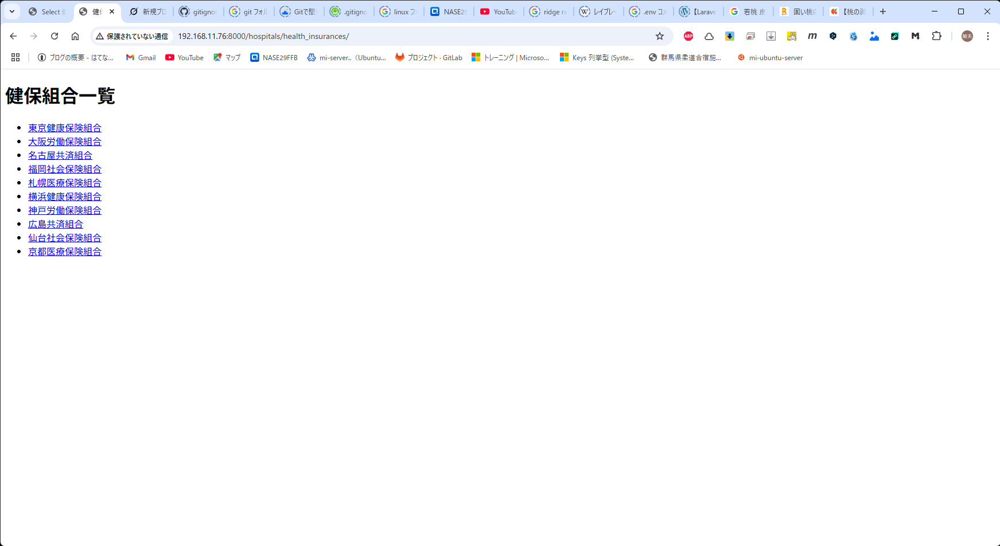


！[管理画面](img/qwen_機能追加依頼_管理画面_マスタ管理更新.png)


```
 > 下記に関する修正をプロジェクト上のソースに直接行ってください。
   ・医療機関、健保組合の登録画面
   ・全体メニュ
   ・仕様書.mdの更新
```

しばらく待つと作ってくれた。    
※適宜、OKの選択あり  

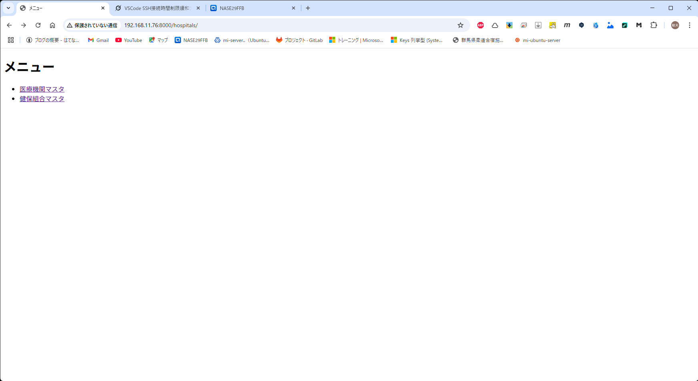

ちとダサいが、見た目の注文つけてないので・・・。


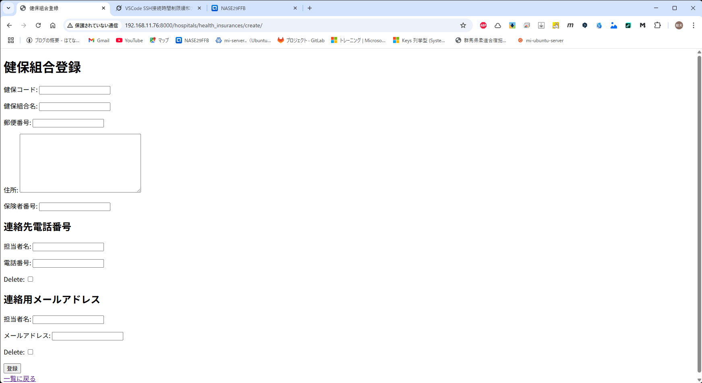

うん、まあ・・・見た目は・・・。

仕様書.md は変わっていなかったので、再度、依頼したが、下記エラーが出現。

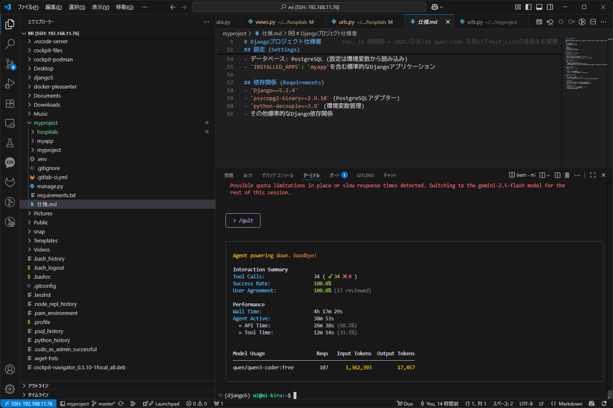

実際どうかはわからないが、使用制限と判断し、終了。  
なお、新規画面が表示されず、404エラーが出ていたが、urls.py の書き順によるものだった。  
※静的＞動的の順

制限については、以下が参照になるかな。  
https://note.com/bokujou3/n/nbceae3c21ee9

