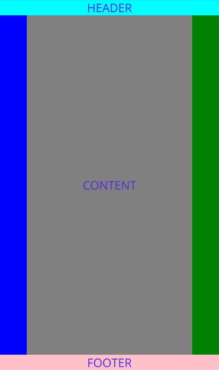

# メモタイトル

## 日付
2025/07/12

## 概要
- 日経BP .NET MAUI によるマルチプラットフォームアプリ開発 を基に学びを記す。

## 4. 画面の部品

### ラベル

#### XAML
```
<Label Text="hoge" />
```

#### よく使うラベルの属性

| 属性(プロパティ) | 説明 | 例 |
|-------|-------|-------|
| FontSize  | フォントサイズ    | 18       |
| HorizontalTextAlignment   | 水平方向の位置    | "Left"       |
| VerticalTextAlignment     | 垂直方向の位置    | "Center"       |
| LineHeight | 行の高さ       | 1.2      |
| Padding      | パディング      | "3,3,3,3"      |
| Text      | 表示するテキスト      | "テキスト"      |
| TextColor      | 表示するテキストの色      | "Red"      |
| BackgroundColor      | 背景色      | ”Green”      |

他  
https://learn.microsoft.com/ja-jp/dotnet/maui/user-interface/controls/label?view=net-maui-9.0


### ボタン

#### XAML

```
<Button Text="実行"
        Clicked="Button1_Clicked" />
```

イベント記載
```
private void Button1_Clicked(Object sender, EventArgs e)
{
    // イベントの内訳
}
```

#### よく使うボタンの属性

| 属性(プロパティ) | 説明 | 例 |
|-------|-------|-------|
| FontSize  | フォントサイズ    | 18       |
| BorderColor   | ボタン境界線の色    | "Red"       |
| BorderWidth     | ボタン境界線の幅    | 3       |
| CornerRadius | ボタン境界線の角の半径       | 3      |
| ImageSource | ボタン背景の画像指定 | "back.jpg" |
| Padding      | パディング      | "3,3,3,3"      |
| Text      | 表示するテキスト      | "テキスト"      |
| TextColor      | 表示するテキストの色      | "Red"      |
| BackgroundColor      | 背景色      | ”Green”      |

他  
https://learn.microsoft.com/ja-jp/dotnet/maui/user-interface/controls/button?view=net-maui-9.0


### テキスト入力

2種類あるようです。

- Entry　…　1行入力
- Editor　…　複数行入力

#### XAML 
```
<Entry 
    x:Name="<オブジェクト名>"
    Placeholder="<プレイスホルダー(山田 太郎 とか)>" 
    />
```

#### よく使うテキスト入力の属性

| 属性(プロパティ) | 説明 | 例 |
|-------|-------|-------|
| FontSize  | フォントサイズ    | 18       |
| Keyboard | 表示されるキーボードの種類 | "Default", "Numeric", "Email" |
| HorizontalTextAlignment   | 水平方向の位置    | "Left"       |
| VerticalTextAlignment     | 垂直方向の位置    | "Center"       |
| IsPassword | 入力文字列のマスキング | "False" |
| Placeholder | 空欄のときに表示される文字列 | "名前を入力してください" |
| ReturnType | ソフトキーボードのリターンキー形状       | "Send"      |
| Text      | 表示するテキスト      | "テキスト"      |
| TextColor      | 表示するテキストの色      | "Red"      |
| BackgroundColor      | 背景色      | ”Green”      |

他  
https://learn.microsoft.com/ja-jp/dotnet/maui/user-interface/controls/entry?view=net-maui-9.0


### レイアウト

主に以下の3つ

- スタックレイアウト
    - VerticalStackLayout　…　垂直方向
    - HorizontalStackLayout　…　水平方向
- グリッドレイアウト
- Flexレイアウト

#### スタックレイアウト

垂直方向に並べる VerticalStackLayout と水平方向に並べる HorizontalStackLayout がある。

##### XAML

```
<VerticalStackLayout 
    VerticalOptions="<並べ方>"
    ・・・ />

<HorizontalStackLayout 
    HorizontalOptions="<並べ方>"
    ・・・ />
```

##### よく使うスタックレイアウトの属性
| 属性(プロパティ) | 説明 |
|-------|-------|
| Margin | マージンの指定 |
| Padding | パディングの指定 |
| Spacing | 子コントロール間のスペース |
| VerticalOptions | レイアウトオプション |
| HorizontalOptions | レイアウトオプション |

レイアウトオプション

| 値 | 説明 |
|---|---|
|Start|左側あるいは上側に配置|
|Center|中央に配置|
|End|右側あるいは下側に配置|
|Fill| 幅あるいは高さいっぱいに配置|

他  
https://learn.microsoft.com/ja-jp/dotnet/maui/user-interface/layouts/verticalstacklayout?view=net-maui-9.0  
https://learn.microsoft.com/ja-jp/dotnet/maui/user-interface/layouts/horizontalstacklayout?view=net-maui-9.0  


#### グリッドレイアウト

格子状にコントロールを並べるレイアウト。

##### XAML

```
<Grid>
    <Grid.RowDifinitions>
        <RowDifinition Height="<高さ>" />
        :
    </Grid.RowDifinitions>
    <Grid.ColumnDifinitions>
        <ColumnDifinition Width="<高さ>" />
        :
    </Grid.ColumnDifinitions>
    <Label Grid.Row="1" Grid.Column="2" />  // Labelコントロールを1行2列目に配置
</Grid>    
```

##### よく使うグリッドレイアウトの属性

| 属性(プロパティ) | 説明 |
|-------|-------|
| Grid.RowDifinitions | グリッドの行数を指定する |
| RowDifinition | それぞれの行の高さを指定　"10" ピクセル指定　"1*" 比率指定 |
| Grid.ColumnDifinitions | グリッドの列数を指定する |
| ColumnDifinition | それぞれの列の幅を指定　"10" ピクセル指定　"1*" 比率指定 |
| Grid.Row | 配置する行の位置 |
| Grid.RowSpan | 行をつなげて配置する |
| Grid.Column | 配置する列の位置 |
| Grid.ColumnSpan | 列をつなげて配置する |

他  
https://learn.microsoft.com/ja-jp/dotnet/maui/user-interface/layouts/grid?view=net-maui-9.0


#### Flexレイアウト

意味のあるエリアごとにコントロールを配置するレイアウト。

##### XAML

```
<FlexLayout Direction="<配置方向>">
    ：
</FlexLayout>
```

##### よく使うFlexレイアウトの属性

| 属性(プロパティ) | 説明 | 例 |
|-------|-------|------|
| Direction | 子コントロールの方向 | "Row" |
| Grow | 使用可能な領域 | "1" |
| Basis | 要求された領域 | "100" |

他  
https://learn.microsoft.com/ja-jp/dotnet/maui/user-interface/layouts/flexlayout?view=net-maui-9.0

聖杯レイアウト

ヘッダーとフッターを持ち、コンテンツ部は左部ナビゲーション領域、右部アサイド領域と本体の3つに分けたレイアウト。

```
<ContentPage xmlns="http://schemas.microsoft.com/dotnet/2021/maui"
             xmlns:x="http://schemas.microsoft.com/winfx/2009/xaml"
             x:Class="FlexLayoutDemos.Views.HolyGrailLayoutPage"
             Title="Holy Grail Layout">

    <FlexLayout Direction="Column">

        <!-- Header -->
        <Label Text="HEADER"
               FontSize="18"
               BackgroundColor="Aqua"
               HorizontalTextAlignment="Center" />

        <!-- Body -->
        <FlexLayout FlexLayout.Grow="1">

            <!-- Content -->
            <Label Text="CONTENT"
                   FontSize="18"
                   BackgroundColor="Gray"
                   HorizontalTextAlignment="Center"
                   VerticalTextAlignment="Center"
                   FlexLayout.Grow="1" />

            <!-- Navigation items-->
            <BoxView FlexLayout.Basis="50"
                     FlexLayout.Order="-1"
                     Color="Blue" />

            <!-- Aside items -->
            <BoxView FlexLayout.Basis="50"
                     Color="Green" />

        </FlexLayout>

        <!-- Footer -->
        <Label Text="FOOTER"
               FontSize="18"
               BackgroundColor="Pink"
               HorizontalTextAlignment="Center" />
    </FlexLayout>
</ContentPage>
```




