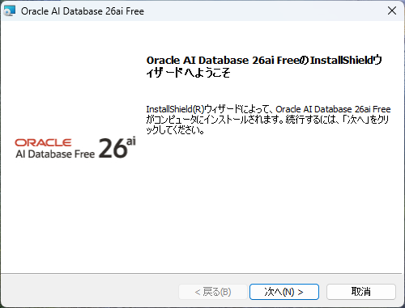
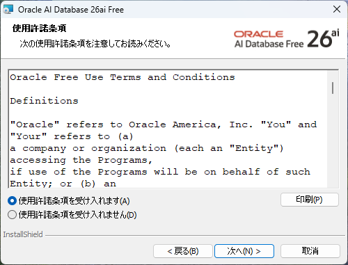
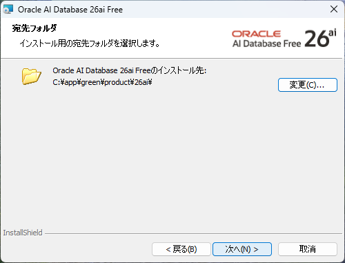
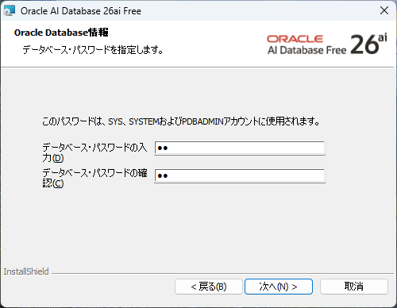
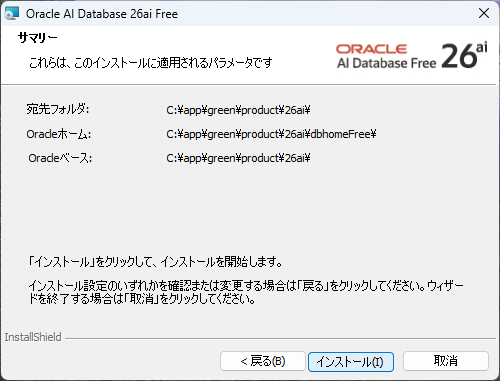
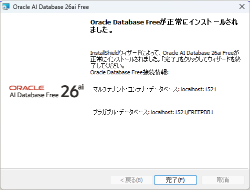

# Oracle database 26ai free インストール

## 1. ダウンロード

https://www.oracle.com/database/free/get-started/

Microsoft Windows x64  
|  |  |
|---|---|
| Filename | oracle-ai-database-free-26ai-23.26.0.windows.x64.zip |
| Download | [Link to download](https://download.oracle.com/otn-pub/otn_software/db-free/oracle-ai-database-free-26ai-23.26.0.windows.x64.zip) |
| SHA256 | 1b844de35a0e7ee1acd1b4e026f15fa135ccc1e22c78287270791788f25e235a |
| File size (in bytes) | 1,388,868,296 |
| Notes |  - [Oracle Database Free Installation Guide](https://docs.oracle.com/en/database/oracle/oracle-database/26/xeinw/installing-oracle-database-xe.html)   - [Oracle Database Client Installation Guide](https://docs.oracle.com/en/database/oracle/oracle-database/26/ntcli/installing-the-oracle-database-client-software.html#GUID-F6B104C6-7A02-4909-9C95-BDED6AF60EAA) |

## 2. インストール

1. ダウンロードした zip ファイルを解凍
2. setup.exe を起動
3. インストーラに従い、進める

    1. 次へ  
        

    2. 使用許諾条項を受け入れます → 次へ  
        

    3. インストール先はデフォルトのまま → 次へ  
        

    4. データベースパスワード → 次へ  
        

    5. インストールパラメータ(操作なし) → 次へ  
        

    6. インストール終了  
        

